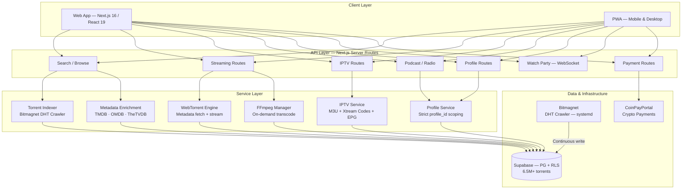
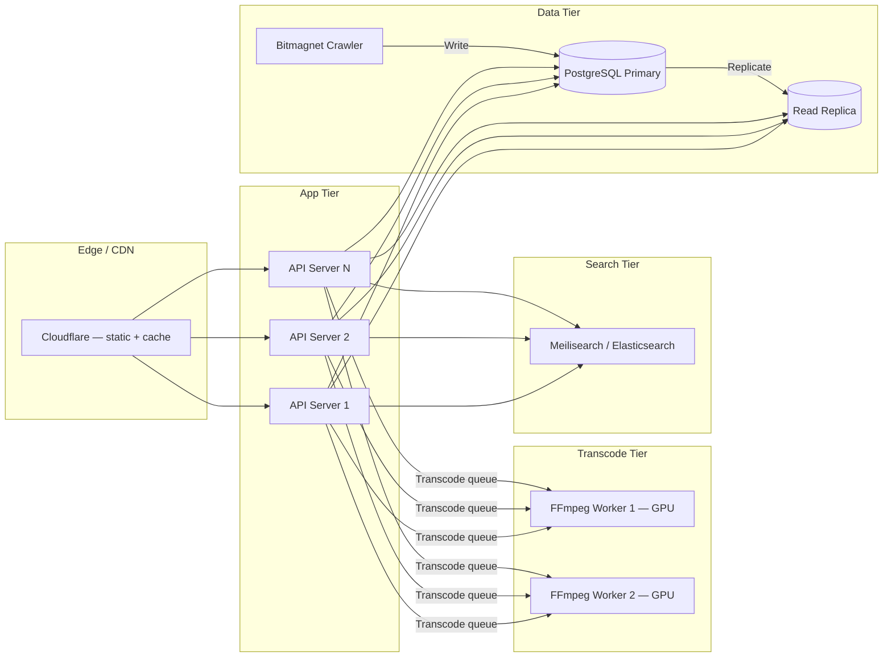

# BitTorrented — High-Volume Media Platform with Profile Isolation

## My Role & Ownership

I designed and implemented the full architecture of BitTorrented, including:

- Multi-media streaming engine (video, music, ebooks, podcasts, radio, IPTV)
- DHT metadata indexing pipeline (6.5M+ torrents via Bitmagnet)
- Netflix-style profile system with strict per-profile data isolation
- IPTV integration layer (M3U playlists, Xtream Codes, EPG)
- Real-time watch party system (synchronized playback + chat)
- Subscription and payment integration (CoinPayPortal crypto + family plans)
- WebTorrent-based streaming (metadata-only fetch, no full downloads)
- Full-text search across 6.5M+ torrents with PostgreSQL trigram indexes
- Production deployment on bare metal (DigitalOcean droplet, UDP for DHT)

Solo architect. Owned system design, data modeling, profile isolation strategy, and production operations.

---

## A. Summary

BitTorrented is a multi-media streaming platform that lets users stream music, movies, ebooks, podcasts, radio, and live TV from torrent and IPTV sources — without downloading content to disk. Think Netflix UX on top of decentralized content sources.

The platform indexes 6.5M+ torrents from the BitTorrent DHT network, supports Netflix-style profiles with strict data isolation, integrates IPTV providers (M3U/Xtream Codes), and handles real-time synchronized watch parties. Payments are handled via CoinPayPortal (crypto) with family plan support for up to 10 profiles per account.

**Live at [bittorrented.com](https://bittorrented.com)**

---

## B. Problem & Requirements

### Problem
Users want a unified media experience — movies, music, books, podcasts, live TV — without managing separate apps, downloads, or storage. Families want shared accounts with personal spaces (history, favorites, collections) that don't bleed into each other.

### Functional Requirements
- Stream video/audio/ebooks directly from torrent metadata (no full download)
- Search across 6.5M+ indexed torrents with sub-second response
- IPTV: live TV from M3U playlists and Xtream Codes providers with EPG
- Podcasts: browse, subscribe, track episode progress
- Radio: browse and favorite stations
- Profiles: Netflix-style per-profile favorites, history, collections, watchlists
- Watch parties: synchronized playback with real-time chat
- Family plans: up to 10 profiles per account
- Payments: crypto via CoinPayPortal

### Non-Functional Requirements
- **Performance**: Full-text search over 6.5M+ rows under 500ms
- **Isolation**: Profile data strictly scoped — no fallback to account-level data
- **Streaming**: WebTorrent metadata-only fetch; transcode on-demand via FFmpeg
- **Availability**: DHT crawler runs continuously; search works even if crawler is behind
- **Security**: All sensitive operations server-side; RLS on all tables; IPTV credentials encrypted

---

## C. Constraints

### Team & Resources
- Solo architect / developer — architecture optimizes for single-person maintainability
- Bare metal deployment (DigitalOcean droplet) required for UDP DHT crawling — serverless won't work
- FFmpeg transcoding is CPU-intensive; must manage resources carefully on shared host (8 cores, 15GB RAM)

### Content & Legal
- No content hosting — platform streams from external torrent peers and IPTV providers
- Metadata-only indexing from DHT (infohash, name, file list, size)
- IPTV providers are user-supplied; platform doesn't distribute playlists

### Technical
- WebTorrent requires browser WebRTC peers or hybrid TCP/UDP bridges
- DHT crawling needs sustained UDP throughput — can't run behind most load balancers
- PostgreSQL full-text search at 6.5M+ rows needs careful index design (trigram + tsvector)
- Profile isolation must be enforced at both application and database level — no fallbacks

### Operational
- Bitmagnet (Go-based DHT crawler) runs as a systemd service, writes directly to PostgreSQL
- Pre-commit hooks OOM on 15GB machine — bypassed with `--no-verify`
- 61 database migrations and counting — must remain idempotent

---

## D. Architecture Overview

### Subsystem Breakdown

| Subsystem | Responsibility | Isolation Boundary |
|-----------|---------------|-------------------|
| **WebTorrent Engine** | Metadata-only fetch from DHT peers; stream chunks to client | Stateless — each stream is an independent session |
| **FFmpeg Manager** | On-demand transcoding (HLS/M3U8) for incompatible codecs | Process-level isolation; resource-limited per transcode |
| **Bitmagnet Crawler** | Continuous DHT indexing; writes torrents to PostgreSQL | Separate systemd service; independent of app server |
| **Profile Service** | All content-scoped queries filtered by `profile_id` | DB-level: RLS policies; App-level: middleware enforces profile cookie |
| **IPTV Service** | M3U parsing, Xtream Codes API, EPG fetching | Account-level (shared across profiles); credentials encrypted |
| **Metadata Enrichment** | TMDB/OMDB/TheTVDB lookups for cover art, descriptions | Cache layer; external API failures don't block search |
| **Watch Party** | WebSocket-based synchronized playback + chat | Session-scoped; no persistent state beyond party lifetime |
| **Search** | Full-text search over 6.5M+ torrents (trigram + tsvector) | Read-only against indexed data; search degradation doesn't affect streaming |

---

## E. Key Design Decisions

### 1. Profile-Scoped Data with No Fallbacks

**Decision:** Every content-scoped table (favorites, history, collections, watchlists, podcast subscriptions, radio favorites) uses `profile_id` as the scoping key. If no profile is selected, the app returns nothing — never falls back to account-level data.

**Why:** Netflix-style profiles require hard isolation. A child's watch history must never leak into a parent's recommendations. Fallback logic creates subtle data leaks that are nearly impossible to audit.

**Tradeoff:** Every authenticated request requires a profile selection step. Single-profile users still see the profile selector (unless they set a per-device default via localStorage).

**What I'd revisit:** Consider auto-selecting the single profile for solo users while maintaining the strict isolation invariant.

### 2. Account-Level vs Profile-Level Data Split

**Decision:** Explicit split — IPTV providers, billing, subscription status, email/password, and family management are account-level. Everything else (favorites, history, collections, podcasts, radio, watchlists) is profile-level.

**Why:** IPTV credentials are expensive (paid subscriptions) and shared across the family. Billing is inherently per-account. But content preferences are personal.

**Tradeoff:** Two different scoping models in the same codebase. Every new feature requires a conscious decision: "Is this account-level or profile-level?"

**What I'd revisit:** Document the decision tree as a contribution guide so future engineers don't default to the wrong scope.

### 3. Bitmagnet for DHT Crawling (Not Custom Crawler)

**Decision:** Use Bitmagnet (Go-based DHT crawler) as a systemd service rather than building a custom Node.js DHT crawler.

**Why:** Bitmagnet handles the hard parts — DHT protocol, metadata fetching, deduplication, queue management — and indexes 500-1000 torrents/hour reliably. Building this from scratch would take months.

**Tradeoff:** Dependency on external Go binary. Schema is Bitmagnet's, not ours. Upgrading Bitmagnet may require migration work.

**What I'd revisit:** If search requirements diverge significantly from Bitmagnet's schema, consider an ETL pipeline that transforms Bitmagnet data into our own optimized search index.

### 4. WebTorrent Metadata-Only Streaming

**Decision:** Use WebTorrent to fetch only the metadata and stream chunks on-demand. No full torrent downloads to disk.

**Why:** Disk space is finite and expensive. Users want instant playback, not downloads. Metadata-only approach means storage costs are near-zero regardless of catalog size.

**Tradeoff:** Streaming quality depends on peer availability. Unpopular torrents may buffer or fail. No offline support.

**What I'd revisit:** Add a selective caching layer for popular content — cache the first N MB of frequently-streamed files for instant start.

### 5. FFmpeg On-Demand Transcoding

**Decision:** Transcode incompatible media formats on-the-fly via FFmpeg, outputting HLS/M3U8 for browser playback.

**Why:** Torrent content comes in every format imaginable (MKV, AVI, FLAC, etc.). Browsers only play a subset. On-demand transcoding avoids pre-processing the entire 6.5M+ catalog.

**Tradeoff:** CPU-intensive. On an 8-core machine, concurrent transcodes compete for resources. No GPU acceleration on the current droplet.

**What I'd revisit:** GPU-accelerated transcoding (NVENC) if migrating to a GPU-equipped host. Or a transcoding queue with configurable concurrency limits.

### 6. PostgreSQL Full-Text Search Over Elasticsearch

**Decision:** Use PostgreSQL trigram indexes + tsvector for full-text search across 6.5M+ torrents, rather than standing up Elasticsearch.

**Why:** One less service to operate. Supabase provides PostgreSQL with good indexing support. At 6.5M rows, PG full-text search with proper indexes returns results in <500ms.

**Tradeoff:** Less sophisticated relevance ranking than Elasticsearch. No fuzzy matching, synonyms, or faceted search out of the box. Index maintenance on a growing dataset.

**What I'd revisit:** At 50M+ torrents, evaluate Elasticsearch or Meilisearch for better relevance and faceted filtering.

### 7. Per-Device Default Profile via localStorage

**Decision:** "Set as default" stores the selected profile ID in `localStorage`, not in the database. Each device remembers its own default.

**Why:** A family sharing one account uses different devices. Dad's TV should default to Dad's profile. Kid's tablet should default to Kid's profile. This is per-device by nature.

**Tradeoff:** Clearing browser data resets the default. No server-side "remember my profile" across devices.

**What I'd revisit:** Optional server-side device registry (fingerprint → profile mapping) for users who want cross-device persistence.

### 8. Middleware-Enforced Profile Selection

**Decision:** Server middleware checks for `x-profile-id` cookie on every authenticated request. Missing cookie → redirect to `/select-profile` (pages) or error (API routes).

**Why:** Enforcement at the middleware level means no route can accidentally skip profile selection. Defense in depth — even if a component forgets to check, middleware catches it.

**Tradeoff:** Every request pays the cost of the middleware check. API routes need explicit exclusion patterns for account-level endpoints.

**What I'd revisit:** Move to a more granular middleware that distinguishes profile-scoped vs account-scoped routes via route metadata rather than exclusion lists.

---

## F. Failure Modes & Blast Radius

| Failure | Blast Radius | Mitigation |
|---------|-------------|------------|
| **Bitmagnet crawler down** | No new torrents indexed; existing 6.5M+ still searchable | systemd auto-restart; search unaffected |
| **WebTorrent peer unavailable** | Specific torrent won't stream; rest of platform unaffected | Timeout + user-facing "no peers" message; suggest alternatives |
| **FFmpeg transcode OOM** | Single stream fails; other streams unaffected | Process-level isolation; `nice` priority; concurrency limits |
| **Supabase outage** | All operations down — search, profiles, streaming metadata | Platform-wide degradation; no mitigation beyond Supabase SLA |
| **IPTV provider down** | Live TV unavailable for that provider; other providers + torrents unaffected | Per-provider health checks; user notification |
| **Profile cookie missing/expired** | User redirected to profile selector; no data leak | Middleware enforcement; explicit redirect flow |
| **Metadata API down (TMDB/OMDB)** | No cover art or descriptions; search and streaming still work | Cached metadata; graceful degradation to raw torrent names |
| **DHT port blocked** | Crawler stops discovering new torrents | Monitor crawl rate; alert on sustained zero-discovery |
| **Concurrent transcode overload** | All streams degrade (buffering, dropped quality) | Concurrency limiter on FFmpeg processes; queue excess requests |
| **PostgreSQL FTS index corruption** | Search returns wrong/no results; streaming unaffected | REINDEX; separate search availability from streaming |

---

## G. Scaling to 10x / 100x

### What Breaks First at 10x (~50k daily active users)

1. **FFmpeg transcoding** — CPU bottleneck. Can't serve 100+ concurrent transcodes on 8 cores. Need dedicated transcoding nodes or GPU acceleration.
2. **PostgreSQL search at 50M+ torrents** — Trigram indexes grow large; query planning degrades. Need search-specific infrastructure.
3. **WebTorrent connections** — Each streaming user holds open peer connections. Connection management becomes a bottleneck.
4. **Single-server architecture** — One droplet handles crawling, API, transcoding, and serving. Any resource spike affects everything.

### Architecture at 100x

- **Separate transcoding tier**: GPU-equipped nodes behind a job queue (Redis/BullMQ). API servers enqueue; workers transcode.
- **Dedicated search**: Meilisearch or Elasticsearch for torrent search. PostgreSQL handles relational data only.
- **Read replicas**: Analytics, browse, and search queries against replica. Writes (favorites, history) against primary.
- **CDN for static + cached streams**: First N seconds of popular content cached at edge.
- **Horizontal API scaling**: Stateless Next.js behind load balancer.

### Observability at Scale

| SLI | SLO | How to Measure |
|-----|-----|----------------|
| Search latency (p99) | < 500ms | API instrumentation |
| Stream start time | < 3s for popular content | Client-side timing |
| Transcode queue depth | < 10 pending | Queue metrics |
| Crawler throughput | > 500 torrents/hour | Bitmagnet logs |
| Profile API latency (p99) | < 200ms | API instrumentation |

### Team Scaling
- **Streaming/Transcode** (1 engineer): FFmpeg pipeline, codec support, caching
- **Search/Indexing** (1 engineer): Search infrastructure, Bitmagnet integration, metadata enrichment
- **Product/Profiles** (1 engineer): Profile features, collections, social features, payments
- **Platform/Infra** (1 engineer): Deployment, monitoring, CDN, scaling

---

## H. What I'd Do Next With 2–3 Engineers

### Streaming Reliability (Engineer 1, Q1)
- GPU-accelerated transcoding (NVENC/VAAPI)
- Transcode job queue with priority and concurrency control
- Adaptive bitrate streaming (multiple quality levels)
- Popular content pre-cache at CDN edge

### Search & Indexing (Engineer 2, Q1-Q2)
- Migrate search to Meilisearch for better relevance and faceted filtering
- ETL pipeline: Bitmagnet → search index (decouple schema)
- Metadata enrichment pipeline (async workers for TMDB/OMDB lookups)
- Search analytics (what people search for, zero-result queries)

### Platform & Observability (Engineer 3, Q2)
- OpenTelemetry tracing across API → transcode → stream
- SLI/SLO dashboards with alerting
- Horizontal API scaling behind load balancer
- Automated deployment pipeline with blue-green deploys
- Profile analytics (per-profile engagement metrics for family plan retention)

### Developer Experience (Ongoing)
- Fix pre-commit hooks (currently bypassed due to OOM)
- Supabase type generation in CI
- Integration test suite for streaming pipeline
- Local dev environment with mock DHT data

---

## I. Links

### Implementation
- [Source Repository (Profullstack org)](https://github.com/profullstack/media-streamer)
- [DHT Crawler PRD](https://github.com/profullstack/media-streamer/blob/master/docs/dht-crawler-prd.md)
- [Deployment Guide](https://github.com/profullstack/media-streamer/blob/master/docs/deployment-droplet.md)

### Related Systems
- [CoinPayPortal Case Study](coinpayportal.md) — Payment infrastructure used for subscriptions
- [Bitmagnet](https://github.com/bitmagnet-io/bitmagnet) — DHT crawler (external dependency)
